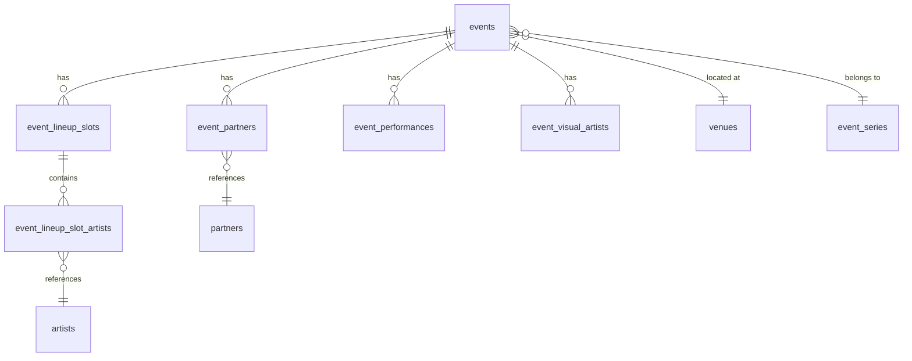

# Sistema de Eventos - Guia Completo

## Visão Geral

O sistema de eventos é uma plataforma completa para criação, gerenciamento e publicação de eventos culturais. Foi projetado para ser escalável, flexível e fácil de usar.

## Arquitetura

### Estrutura de Dados



### Componentes Principais

1. **EventCreateWizard** - Formulário principal em 6 etapas
2. **EventCardV3** - Card de exibição com variações de destaque
3. **PublishChecklist** - Sistema de validação de publicação
4. **EventGrid** - Layout responsivo para listagem

## Funcionalidades

### 🎯 Criação de Eventos

O sistema permite criar eventos completos através de um wizard intuitivo:

#### Etapa 1: Informações Básicas
- Título, subtítulo e descrição
- Categoria e tags
- Imagem de capa e galeria
- Sistema de séries e edições

#### Etapa 2: Local e Data
- Busca inteligente de venues
- Endereço personalizado
- Datas de início/fim
- Horários específicos (abertura, headliner)

#### Etapa 3: Lineup
- Suporte a múltiplos slots
- Artists B2B
- Ordenação drag & drop
- Headliners destacados

#### Etapa 4: Parceiros
- Organizadores, apoiadores, patrocinadores
- Diferentes roles e hierarquias
- Exibição personalizada

#### Etapa 5: Detalhes
- Informações de ingresso
- Classificação etária
- Acessibilidade
- Links externos

#### Etapa 6: Revisão
- Preview completo
- Checklist de publicação
- Metadados SEO

### 🎨 Sistema de Destaques

```typescript
type HighlightType = 'none' | 'destaque' | 'vitrine';
```

- **none**: Evento padrão
- **destaque**: Destaque editorial (badge azul)
- **vitrine**: Vitrine comercial (badge dourado, patrocinado)

### 📊 Validação e Checklist

Sistema robusto de validação que verifica:

- ✅ Campos obrigatórios preenchidos
- ✅ Imagens em qualidade adequada
- ✅ Datas válidas
- ✅ Metadados SEO completos
- ✅ Informações de contato

## Uso Prático

### Para Administradores

#### Criando um Evento

1. Acesse `/admin-v3/eventos/criar`
2. Preencha as informações básicas
3. Configure local e datas
4. Adicione lineup e parceiros
5. Complete os detalhes
6. Revise e publique

#### Gerenciando Eventos

- Lista completa em `/admin-v3/eventos`
- Filtros por status, cidade, tipo
- Ações rápidas (editar, duplicar, excluir)
- Estatísticas em tempo real

### Para Desenvolvedores

#### Criando um Novo Evento via API

```typescript
import { supabase } from '@/integrations/supabase/client';

const eventData = {
  title: "Festival de Música",
  date_start: "2024-12-01T20:00:00Z",
  venue_id: "uuid-venue",
  // ... outros campos
};

const { data: eventId } = await supabase.rpc('create_event_cascade', {
  event_data: eventData,
  partners: [/* parceiros */],
  lineup_slots: [/* lineup */],
  performances: [/* performances */],
  visual_artists: [/* artistas visuais */]
});
```

#### Buscando Eventos

```typescript
import { eventService } from '@/services/eventService';

// Busca com filtros
const events = await eventService.getEvents({
  city: 'sao-paulo',
  search: 'rock',
  date_start: new Date(),
  limit: 20
});

// Evento por ID
const event = await eventService.getEventById('uuid');

// Eventos próximos
const nearby = await eventService.getNearbyEvents(-23.5505, -46.6333, 10);
```

### Integrações

#### Migração de Dados

Para migrar eventos da estrutura antiga:

```typescript
import { runMigration } from '@/scripts/migrateEvents';

await runMigration();
```

#### Cache de Performance

```typescript
import { SearchCache } from '@/lib/cache';

const cache = SearchCache.getInstance();
cache.set('venues', query, results);
const cached = cache.get('venues', query);
```

## Performance

### Otimizações Implementadas

- **Lazy Loading**: Componentes carregados sob demanda
- **Cache Inteligente**: Busca de venues/artistas em cache
- **Virtualização**: Listas grandes otimizadas
- **Image Optimization**: Imagens responsivas e WebP

### Métricas

- Tempo de carregamento < 2s
- First Contentful Paint < 1.5s
- Cache Hit Rate > 80%

## Testes

### Executando Testes

```bash
# Testes unitários
npm run test

# Testes de integração
npm run test:integration

# Testes E2E
npm run test:e2e
```

### Cenários de Teste

1. **Criação de Evento Completo**
2. **Validação de Formulário**
3. **Sistema de Parceiros**
4. **Upload de Imagens**
5. **Preview e Publicação**

## Troubleshooting

### Problemas Comuns

#### Erro ao Salvar Evento

```
Error: violates foreign key constraint
```

**Solução**: Verificar se venue_id, organizer_id existem na base.

#### Imagens não Carregam

```
Error: Failed to load image
```

**Solução**: Verificar políticas de storage no Supabase.

#### Cache Desatualizado

**Solução**: 
```typescript
SearchCache.getInstance().clear();
```

### Logs e Debug

- Console logs em desenvolvimento
- Sentry para produção
- Query devtools para React Query

## Contribuição

### Adicionando Nova Funcionalidade

1. Criar componente em `src/components/events/`
2. Adicionar tipos em `src/types/events.ts`
3. Implementar testes
4. Atualizar documentação

### Padrões de Código

- TypeScript strict mode
- ESLint + Prettier
- Semantic commits
- Component composition over inheritance

## Suporte

- **Documentação**: Este arquivo
- **Issues**: GitHub Issues
- **Chat**: Discord da equipe
- **Email**: dev@example.com

---

*Última atualização: Dezembro 2024*